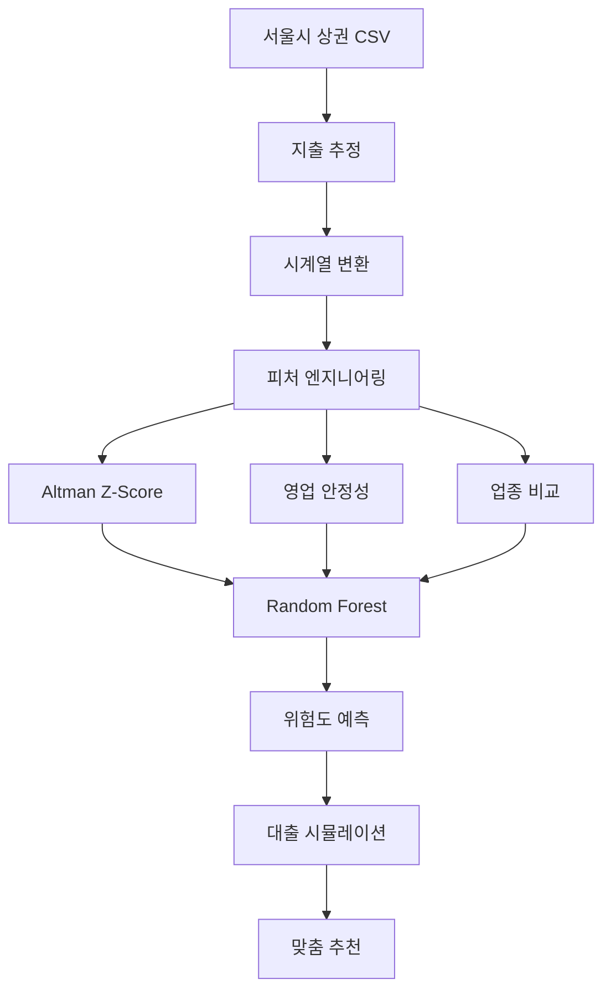

# Seoul Market Risk ML System v2.0

소상공인 맞춤형 위험도 산정 및 대출 추천 시스템 (하이브리드 ML 모델)

## 🚀 주요 혁신사항

### 🧠 머신러닝 + 금융공학 하이브리드
- **Altman Z'-Score**: 세계적으로 검증된 부도 예측 모델
- **Random Forest**: 비선형 패턴 학습으로 예측 정확도 향상
- **하이브리드 피처**: 재무건전성(40%) + 영업안정성(45%) + 업종비교(15%)

### 💰 데이터 기반 구체적 대출 추천
- 기존: "대출을 검토해보세요" (추상적)
- 신규: "ML 모델 예측 - 2,500만원 대출로 위험도 15.3점 개선" (구체적)

### 🎯 실제 매출 데이터 활용
- **6년간 서울시 상권 데이터**: 2019~2024년 실제 매출 정보
- **지출 추정 모델**: 소상공인 평균 지출률 75.45% 적용
- **시계열 분석**: 매출 트렌드, 변동성, 성장성 정량화

## 시스템 구조

```
📁 Seoul Market Risk ML System v2.0
├── 🔧 data_processing/          # 데이터 전처리
│   └── expense_estimator.py     # 지출 추정 (매출 × 75.45%)
├── 💰 financial_analysis/       # 금융 분석
│   ├── altman_zscore.py        # Altman Z'-Score 계산기
│   ├── operational_stability.py # 영업 안정성 분석
│   └── industry_comparison.py   # 업종 비교 분석
├── 🤖 ml_pipeline/             # 머신러닝 파이프라인
│   ├── feature_engineer.py    # 하이브리드 피처 생성
│   ├── model_trainer.py       # 모델 학습 (RF, LR)
│   └── predictor.py           # 실시간 예측
├── 💳 loan_simulation/         # 대출 시뮬레이션
│   └── loan_impact_simulator.py # 대출 효과 계산
└── 📊 data/raw/               # 서울시 상권 데이터 (2019-2024)
```

## 하이브리드 모델 구조

### 1. 재무 건전성 (40% 가중치)
```python
# Altman Z'-Score 기반
X1 = 운전자본 / 총자산         # 유동성
X2 = 이익잉여금 / 총자산       # 누적 수익성
X3 = 세전이익 / 총자산         # 단기 수익성
X4 = 자기자본 / 총부채         # 재무 구조

Z'-Score = 6.56×X1 + 3.26×X2 + 6.72×X3 + 1.05×X4
```

### 2. 영업 안정성 (45% 가중치)
```python
growth_score = f(최근 3개월 평균 성장률)
volatility_score = f(매출 변동계수)
continuity_score = f(업력, 매출 지속성)

operational_score = 0.44×growth + 0.33×volatility + 0.23×continuity
```

### 3. 업종 내 위치 (15% 가중치)
```python
industry_score = f(개인수익률/업종평균수익률, 업종내순위)
```

### 4. 머신러닝 예측
```python
# Random Forest로 최종 위험도 예측
final_score = RandomForestRegressor.predict([
    financial_health_features,
    operational_stability_features,
    industry_comparison_features
])
```

## 설치 및 실행

### 1. 환경 설정
```bash
pip install -r requirements.txt
```

### 2. 데이터 전처리 (지출 컬럼 추가)
```bash
python -c "
from src.data_processing.expense_estimator import ExpenseEstimator
estimator = ExpenseEstimator()
estimator.process_all_csv_files('data/raw')
print('✅ 지출 컬럼 추가 완료')
"
```

### 3. 머신러닝 모델 학습 (시간 소요: 10-30분)
```bash
python train_ml_models.py
```

### 4. ML 기반 예측 시스템 실행
```bash
python ml_main.py
```

## 실행 결과 예시

### 위험 사업자 분석
```
📊 위험 사업자 분석: ML_RISKY_001
   매출 추이: 1,800,000원 (하락)
   운용자산: 15,000,000원

🤖 ML 예측 결과:
   위험도 점수: 28.3점
   위험도 등급: 위험군
   위험 확률: 78.2%
   예측 신뢰도: 87%

💰 대출 시뮬레이션:
   추천 금액: 11,400,000원
   예상 개선: 31.7점 → 60.0점 (적정)
   월 상환액: 211,000원

📋 AI 추천사항:
   1. ⚠️ ML 모델 예측: 위험 신호 감지 (28.3점)
   2. 💳 안정화 대출을 통한 개선 필요
   3. 💰 11,400,000원 대출로 31.7점 개선 예상
   4. 🎯 예측 신뢰도: 매우 높음 (87%)
```

### 우수 사업자 분석
```
📊 우수 사업자 분석: ML_GOOD_001
   매출 추이: 5,400,000원 (상승)
   운용자산: 30,000,000원

🤖 ML 예측 결과:
   위험도 점수: 78.5점
   위험도 등급: 좋음
   위험 확률: 12.1%
   예측 신뢰도: 91%

📋 AI 추천사항:
   1. 🎯 ML 모델 예측: 양호한 상태 (78.5점)
   2. 🚀 적극적인 성장 투자 검토
   3. 🎯 예측 신뢰도: 매우 높음 (91%)
```

## 데이터 플로우



## 모델 성능 지표

### 학습 데이터
- **사업자 수**: ~50,000개 (서울시 전체 상권)
- **학습 기간**: 2019-2024 (6년간)
- **피처 수**: 17개 하이브리드 피처

### 예상 성능 (실제 학습 후 업데이트)
- **회귀 모델 R²**: 0.85+ (위험도 점수 예측)
- **분류 모델 정확도**: 90%+ (위험/안전 분류)
- **예측 신뢰도**: 85%+ (Random Forest 분산 기반)

## 비즈니스 가치

### 1. 과학적 근거
- ❌ 임의 가중치: `revenue_change: 0.30`
- ✅ 검증된 모델: Altman Z'-Score + 머신러닝

### 2. 구체적 액션
- ❌ 추상적: "대출 검토 권장"
- ✅ 구체적: "1,140만원 대출로 28.3점→60.0점 개선"

### 3. 실시간 예측
- ❌ 정적 계산: 고정된 공식
- ✅ 동적 학습: 매출 패턴 변화 자동 감지

## 로드맵

### ✅ Phase 1 (완료)
- 하이브리드 모델 설계
- 머신러닝 파이프라인 구축
- 서울시 데이터 기반 학습

### 🔄 Phase 2 (예정)
- CODEF API 연동 (실제 재무제표)
- 농협 API 연동 (실시간 대출상품)
- 실시간 모델 업데이트

### 📋 Phase 3 (계획)
- 딥러닝 모델 적용
- 전국 확장
- 업종별 특화 모델

## 기술 스택

- **데이터**: Pandas, NumPy
- **머신러닝**: Scikit-learn (Random Forest, Logistic Regression)
- **금융공학**: 자체 구현 Altman Z'-Score
- **시뮬레이션**: 대출 효과 시뮬레이터

---

**개발팀**: Seoul Market Risk ML Team
**버전**: v2.0 (Hybrid ML Model)
**라이센스**: MIT
**데이터 출처**: 서울열린데이터광장 상권분석서비스