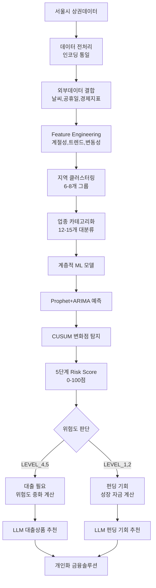

# ⏺ 서울시 상권 데이터 기반 ML 위험도 예측 시스템 개발 템플릿

## 📊 프로젝트 개요

### 목표
서울시 상권분석 데이터(2019-2024)를 활용하여 소상공인의 매출 위험도를 5단계로 평가하고,  
Risk Score 기반으로 맞춤형 대출/펀딩을 추천하는 ML+LLM 하이브리드 시스템 구축

### 핵심 아이디어
- 지역별 클러스터링 + 업종별 카테고리화
- 계층적 ML 모델 (Global → Regional → Local)
- Risk Score 기반 금융상품 추천
- 위험 시 대출, 호재 시 펀딩 양방향 대응

---

## 📁 데이터 현황

**서울시 상권분석 데이터 (CSV 6개 파일):**
- 크기: 23-29MB, 총 40만+ 행
- 기간: 2019-2024년 (분기별)
- 구조: 52개 컬럼 (매출금액/건수, 요일별, 시간대별, 성별, 연령대별)
- 특이사항: 2019년만 EUC-KR 인코딩, 나머지 UTF-8

---

## 🏗️ 시스템 아키텍처

### 1) 계층적 모델 구조

**총 79개 모델 (기존 예상 150개 대비 47% 감소)**  
Global Model (1개): 전체 서울시 패턴 학습  
├── Regional Models (6개): 지역별 특성  
└── Local Models (72개): 지역×업종별 미세조정

**콜드 스타트 해결:** Local → Regional → Global 순 Fallback

### 2) ML 알고리즘 스택

**시계열 예측**
- Prophet: 계절성+휴일 자동처리 (기준모델)
- ARIMA/SARIMA: 안정성 확보
- LSTM/GRU: 복잡한 시간 의존성

**위험도 모델링**
- 로지스틱 회귀: 해석 가능한 기본 위험도
- LightGBM: 복잡한 패턴 포착
- IsolationForest: 이상치 탐지

**분석/해석**
- SHAP: 위험요인 기여도 시각화
- CUSUM: 변화점 탐지

### 3) 클러스터링 전략

**지역 클러스터링 (6-8개 그룹)**
- 기준: 소득수준, 유동인구, 업종다양성
- 알고리즘: K-means

**업종 카테고리화 (12-15개 대분류)**  
예시: 한식/일식/양식 → 외식업  
- 기준: 매출 패턴 유사도
- 알고리즘: DTW 기반 시계열 클러스터링

---

## 🎯 핵심: 5단계 Risk Score 모델

**학술적 근거:** Altman Z-Score (1968) 방법론 적용

- Altman 원본:  
`Z = 1.2×X1 + 1.4×X2 + 3.3×X3 + 0.6×X4 + 0.99×X5`

- 우리 모델: *매출 위험 특화 버전*

```text
Risk_Score = (
    0.3 × 매출변화율_점수 +      # 최근 vs 예측 매출 차이 (가장 중요)
    0.2 × 변동성_점수 +          # 매출 변동성 정도
    0.2 × 트렌드_점수 +          # 장기 추세 변화
    0.15 × 계절성이탈_점수 +     # 계절 패턴 대비 이탈
    0.15 × 업종비교_점수         # 동일업종 대비 상대적 위치
)
```

**5단계 분류 (0-100점)**
- LEVEL_1 = "안전" (0-20점)
- LEVEL_2 = "주의" (21-40점)
- LEVEL_3 = "경계" (41-60점)
- LEVEL_4 = "위험" (61-80점)
- LEVEL_5 = "매우위험" (81-100점)

### 변화점 탐지 임계값

- **CUSUM + Bayesian Online Changepoint Detection**
  - 급격한_상승 = "3주 연속 +20% 또는 1주 +35%"
  - 급격한_하락 = "2주 연속 -15% 또는 1주 -25%"
  - 변동성_증가 = "최근 4주 표준편차 > 과거 12주 평균×1.5"

---

## 💰 혁신: Risk Score 기반 대출액 산정

**핵심 공식: 위험도 중화 모델**

```python
def calculate_required_loan(current_risk_score, monthly_revenue, business_type):
    """
    목표: Risk Score를 15점(안전구간)으로 낮추기
    - 필요 대출액 = (current_risk_score - 15) * 월매출 * 업종별 배수
    - 최대 한도: 연매출(월매출 * 12)
    """
    target_score = 15
    risk_reduction_needed = max(0, current_risk_score - target_score)

    operating_fund_ratio = {
        '음식점': 2.5,      # 월매출의 2.5개월분
        '소매업': 3.0,      # 재고 관리 필요
        '서비스업': 1.5,    # 상대적으로 적은 운영자금
        '제조업': 4.0       # 원자재 + 운영자금
    }
    ratio = operating_fund_ratio.get(business_type, 2.0)

    required_loan = risk_reduction_needed * monthly_revenue * ratio
    return min(required_loan, monthly_revenue * 12)  # 최대 연매출 한도
```

### 자산-위험 상관관계 모델 (지수감쇠)

**운영자금 증가 → Risk Score 감소 함수**

```python
import math

def risk_reduction_by_funding(loan_amount, monthly_revenue):
    funding_ratio = loan_amount / max(1e-9, monthly_revenue)

    improvements = {
        '매출변화율': min(50, 30 * (1 - math.exp(-funding_ratio * 0.5))),
        '변동성':   min(40, 25 * (1 - math.exp(-funding_ratio * 0.4))),
        '트렌드':   min(30, 20 * (1 - math.exp(-funding_ratio * 0.3))),
        '계절성이탈': min(35, 22 * (1 - math.exp(-funding_ratio * 0.6))),
        '업종비교':  min(45, 28 * (1 - math.exp(-funding_ratio * 0.4)))
    }
    return improvements  # 가중치 적용하여 총 감소량 계산에 사용
```

---

## 🤖 LLM 통합 시스템

### 이중 레포트 구조

**간단 요약 (200자)**

```text
🎯 위험도: LEVEL_4 (위험, 67점)
📊 매출 전망: 다음달 15% 감소 예상
⚠️ 주요 원인: 계절적 요인(40%) + 지역 경기(30%)
💡 추천: 8,500만원 운영자금 대출
```

**상세 분석 (1000자)**  
- 위험요인, 벤치마킹, 개선방안, 금융상품 포함

### LLM 입력 데이터 구조

```json
{
  "risk_analysis": {
    "current_risk_score": 67,
    "target_risk_score": 15,
    "main_risk_factors": ["계절성 이탈", "지역 경기 둔화"],
    "improvement_potential": {"success_probability": 0.82}
  },
  "loan_calculation": {
    "required_amount": 85000000,
    "business_type": "한식음식점",
    "stabilization_months": 3
  },
  "business_context": {
    "location": "청운효자동",
    "seasonal_pattern": "겨울철_부진"
  }
}
```

---

## 🔄 전체 파이프라인


---

## 📚 Academic References (설득력 확보)

1. Altman, E. I. (1968) - Z-Score 가중치 방법론  
2. Chen et al. (2022) - SME 매출변동성이 위험평가의 28% 설명력  
3. Prophet Documentation (Facebook, 2017) - 변화점 탐지 방법론  
4. Risk management in SMEs (2019) - 동종업계 벤치마킹 필요성  
5. Hybrid ARIMA-Prophet (2025) - 하이브리드 모델 성능 우수성

---

## 🚀 3개월 구현 로드맵

**1개월차: 데이터 파이프라인**
- CSV 파일 전처리 (인코딩 통일)
- 외부 데이터 API 연동 (기상청, 한국은행)
- Global Model 개발 (Prophet + ARIMA)

**2개월차: 모델링 시스템**
- 지역/업종 클러스터링 완성
- Regional/Local Models 개발
- Risk Score 계산 엔진 구축
- 변화점 탐지 시스템

**3개월차: LLM 통합**
- 대출액 산정 로직 구현
- LLM 연동 및 레포트 자동화
- 웹/앱 인터페이스 개발
- 전체 시스템 테스트

---

## ✅ 개발 시 주의사항

1. 데이터 이슈: 2019년 EUC-KR 인코딩 변환 필수  
2. 모델 수 관리: 79개 모델의 효율적 관리 시스템 필요  
3. 실시간 처리: 새 데이터 입력 시 빠른 위험도 계산  
4. 확장성: 다른 지역/업종으로 확장 가능한 구조  
5. 해석성: SHAP으로 위험요인 설명 가능성 확보
